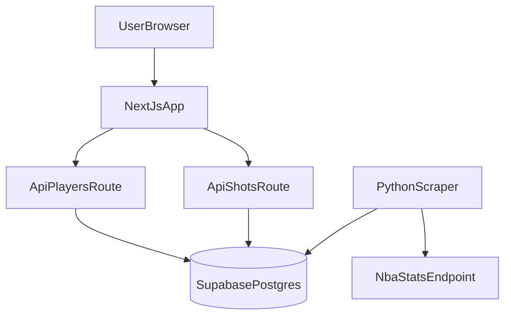

# Can He Shoot?


A full-stack student project that visualizes NBA shooting tendencies with interactive shot maps. The frontend is built with Next.js/React, data is served from Supabase, and a Python ingestion script syncs shot and roster data from `stats.nba.com`.

## Deployment Architecture

- **Frontend:** Next.js app deployed on Vercel.
- **Database:** Supabase Postgres on the free tier.
- **Connection model:** Vercel server-side routes (`/api/players`, `/api/shots/[playerId]`) read from Supabase using `SUPABASE_URL` + `SUPABASE_ANON_KEY` under RLS.
- **Current data state:** 2025-26 roster + shot data has already been loaded into Supabase, so the deployed app serves data directly from the database without requiring live scraping at request time.

## Usage

### 1) Install and run locally

```bash
npm install
npm run dev
```

Then open [http://localhost:3000](http://localhost:3000).

### 2) App environment variables

Set these for local development and deployment:

```bash
SUPABASE_URL=...
SUPABASE_ANON_KEY=...
```

The app performs server-side reads only, under Row Level Security.

### 3) Scraper environment variables

For ingestion jobs only (do not expose to browser):

```bash
SUPABASE_URL=...
SUPABASE_SERVICE_ROLE_KEY=...
```

### 4) Run scraper

Install Python dependencies:

```bash
pip install -r scripts/requirements.txt
```

Run sync modes:

```bash
# Current dataset in Supabase is already loaded for 2025-26.
# To ingest a different year, pass --season (examples below).

# Players + shots
python scripts/nba_scraper.py --mode all
python scripts/nba_scraper.py --mode all --season 2026-27

# Players only
python scripts/nba_scraper.py --mode players
python scripts/nba_scraper.py --mode players --season 2026-27

# Shots only
python scripts/nba_scraper.py --mode shots
python scripts/nba_scraper.py --mode shots --season-type Playoffs
python scripts/nba_scraper.py --mode shots --season 2026-27 --season-type "Regular Season"
```

### 5) Run quality checks

```bash
npm run lint
npm run typecheck
npm run test:ci
```

## System and Architecture

### Product behavior

- Search active players by name
- Toggle `Regular Season` / `Playoffs`
- Switch between:
  - **Heatmap** (zone FG% vs league average)
  - **Shot Chart** (hexbin density view)
- Inspect shooting totals and zone details in side panel + tooltips

### High-level flow



### Runtime data flow

```text
Browser -> /api/players          -> Supabase nba_players (revalidate 24h)
Browser -> /api/shots/[playerId] -> Supabase nba_shots   (revalidate 30m)
```

`/api/shots/[playerId]` paginates reads in 1000-row chunks so high-volume players return complete histories.

### Ingestion design

- `scripts/nba_scraper.py` uses bounded retries and jittered delays between NBA requests.
- `--mode all` uses one players request and four league-wide shot windows (three regular-season windows + playoffs), not per-player shot loops.
- Upserts are idempotent:
  - `nba_players` keyed by `person_id`
  - `nba_shots` keyed by `shot_id`
- Playoff rows use `po_` prefixed `shot_id` values to avoid collisions with regular-season rows.

### Supabase security setup (RLS)

Run once in Supabase SQL editor:

```sql
alter table public.nba_players enable row level security;
alter table public.nba_shots enable row level security;

drop policy if exists "Public read nba_players" on public.nba_players;
drop policy if exists "Public read nba_shots" on public.nba_shots;

create policy "Public read nba_players"
  on public.nba_players for select
  to anon, authenticated
  using (true);

create policy "Public read nba_shots"
  on public.nba_shots for select
  to anon, authenticated
  using (true);
```

Also ensure `season_type` exists on `nba_shots`:

```sql
alter table nba_shots
  add column if not exists season_type text not null default 'Regular Season';

create index if not exists idx_nba_shots_person_id_season_type
  on nba_shots (person_id, season_type);
```

## CI workflow note

This repo stores the workflow definition at `scripts/ci.yml` per project preference. GitHub auto-discovers workflow files only under `.github/workflows/`, so copy or symlink this file there if you want Actions to run automatically on GitHub.

## Limitations and Tradeoffs

- `stats.nba.com` is Akamai-protected, so fully automated cloud scraping can be unstable.
- The project prioritizes stable frontend UX and deterministic testability over always-on live scraping.
- Recommended operation is periodic/manual ingestion into Supabase, then serving from the database.
