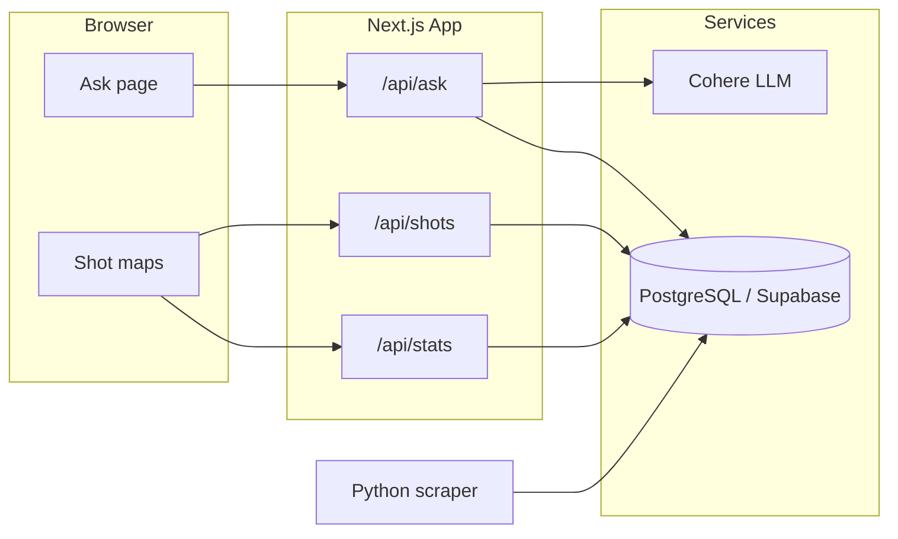

# Can He Shoot?

**Ask NBA shooting questions in plain English. Get answers backed by real data — then jump to interactive shot charts.**


---

## What it is

A full-stack NBA analytics app with two main experiences:

1. **Ask** — type a question like *"What was Steph Curry's corner 3PT%?"* and get a natural-language answer sourced from a Postgres database.
2. **Shot maps** — explore any active player's heatmaps, hexbin shot charts, and season box scores.

Built as a portfolio project demonstrating **LLM integration**, **text-to-SQL**, **data visualization**, and **production-minded API design** (validation, rate limiting, read-only database access).

---

## Highlights

| | |
|---|---|
| **Text-to-SQL pipeline** | Cohere converts natural language → validated `SELECT` queries against a real NBA schema |
| **Safe LLM usage** | Query allowlists, keyword guards, read-only Postgres role, opponent-question detection to prevent hallucinated stats |
| **Interactive viz** | D3-powered heatmaps and hexbin charts with league-average comparisons and zone-level stats |
| **Full-stack Next.js** | App Router, server-side data fetching, REST API routes, responsive UI with light/dark theme |
| **Data pipeline** | Python scraper ingests players, shot locations, and season stats from `stats.nba.com` into Supabase |
| **Tested & CI** | 76+ Vitest unit/integration tests; GitHub Actions runs lint, typecheck, and tests on every PR |

---

## Tech stack

| Layer | Tools |
|-------|-------|
| **Frontend** | Next.js 15, React 19, TypeScript, Tailwind CSS, D3.js, next-themes |
| **Backend / API** | Next.js Route Handlers, Zod validation, in-memory rate limiting |
| **AI** | Cohere API — structured JSON output for SQL generation and answer summarization |
| **Database** | Supabase (PostgreSQL) — RLS policies, dedicated `ask_readonly` role for Ask queries |
| **Data ingestion** | Python scraper → Supabase (`nba_players`, `nba_shots`, `nba_player_stats`) |
| **Quality** | Vitest, ESLint, TypeScript strict mode, GitHub Actions CI |

---

## How it works



**Ask flow (simplified):** question → LLM generates SQL → server validates and resolves player names → query runs on a read-only DB role → LLM summarizes results → UI renders enriched answer with links to shot charts.

**Shot maps:** select a player → fetch shot coordinates and season stats from Supabase → render zone heatmaps or hexbin density charts with regular season / playoff toggle.

---

## Features

- Natural-language Q&A over shooting and season stats (StatMuse-style)
- Player search across the active NBA roster
- Zone heatmaps comparing a player to league averages
- Hexbin shot charts with make/miss filtering
- Per-game season stats sidebar (PTS, REB, AST, shooting splits)
- Deep links from Ask answers to individual player shot charts
- Light / dark mode

---

## For developers

### Quick start

```bash
npm install
cp .env.example .env.local   # fill in Supabase, Cohere, and readonly DB credentials
npm run dev
```

Open [http://localhost:3000](http://localhost:3000).

### Environment variables

| Variable | Purpose |
|----------|---------|
| `SUPABASE_URL` / `SUPABASE_ANON_KEY` | Server-side Supabase reads |
| `COHERE_API_KEY` | Ask SQL generation and answer summarization |
| `ASK_READONLY_DATABASE_URL` | Pooled Postgres connection for Ask queries |
| `SUPABASE_SERVICE_ROLE_KEY` | Scraper only — never expose to the frontend |

Run [`scripts/ask_readonly_setup.sql`](scripts/ask_readonly_setup.sql) in Supabase before enabling Ask.

### Data ingestion

```bash
pip install -r scripts/requirements.txt
python scripts/nba_scraper.py --mode all
```

Modes: `players`, `shots`, `stats`. See the script for season-type flags.

### Development commands

```bash
npm run lint
npm run typecheck
npm run test:ci
```

### API routes

| Route | Description |
|-------|-------------|
| `POST /api/ask` | Natural-language query |
| `GET /api/shots/[playerId]?seasonType=` | Shot locations and zone aggregates |
| `GET /api/stats/[playerId]?seasonType=` | Per-game season stats |

Player lists are fetched server-side on stats pages — there is no `/api/players` route.

### Project structure (selected)

```
app/           Next.js pages and API routes
components/    Ask UI, shot charts, player search
lib/cohere/    LLM prompts and client
lib/sql/       Query validation, player filter rewriting
lib/nba/       Data access, court geometry, types
lib/ask/       Unsupported-question detection
scripts/       Python scraper and DB setup SQL
tests/         Vitest unit and integration tests
```

### Known limitations

- Data is scraped periodically, not live at request time
- No opponent/matchup stats (not in the source schema)
- Ask SQL validation is regex-based; rate limiting is in-memory per IP
- Single season (`2025-26`) unless the scraper is run for another year
