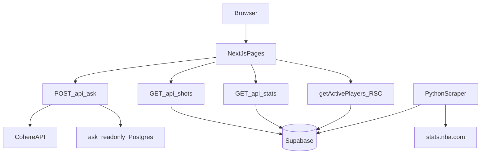

# Can He Shoot?


NBA shooting analytics with a natural-language **Ask** interface and interactive shot maps. Ask questions in plain English, get StatMuse-style answers from Supabase data, or browse per-player heatmaps and hexbin charts with season box scores.

## Features

| Area | What it does |
|------|----------------|
| **Ask** (`/`) | NL questions → Cohere generates SQL → read-only Postgres → headline answer + table + player links |
| **Shot maps** (`/stats`) | Search active roster, heatmap vs league, hexbin shot chart, zone tooltips |
| **Player detail** (`/stats/[personId]`) | Deep-link to a player's shot map and season stats |
| **Season stats panel** | Per-game box score (PTS/REB/AST, shooting splits, GP/MIN/+/-) with independent RS/PO toggle when playoff data exists |
| **Theme** | Light/dark mode via header toggle; defaults to system preference |

## Routes

### Pages

| Route | Purpose |
|-------|---------|
| `/` | Ask homepage |
| `/stats` | Browse players + shot maps |
| `/stats/[personId]` | Player shot chart detail |

### API

| Route | Purpose |
|-------|---------|
| `POST /api/ask` | Natural-language query (Cohere + readonly Postgres) |
| `GET /api/shots/[playerId]?seasonType=` | Shot locations, zone aggregates, totals, league averages |
| `GET /api/stats/[playerId]?seasonType=` | Per-game season stats from `nba_player_stats` |

Player lists are loaded server-side via `getActivePlayers()` on stats pages — not through a separate API route.

## Quick start

```bash
npm install
cp .env.example .env.local   # fill in values
npm run dev
```

Open [http://localhost:3000](http://localhost:3000).

### Environment variables

```bash
# App (server-side only)
SUPABASE_URL=...
SUPABASE_ANON_KEY=...
COHERE_API_KEY=...
ASK_READONLY_DATABASE_URL=...

# Scraper only — never expose to browser or Vercel frontend
SUPABASE_SERVICE_ROLE_KEY=...
```

**Ask readonly setup:** run [`scripts/ask_readonly_setup.sql`](scripts/ask_readonly_setup.sql) in Supabase, then set `ASK_READONLY_DATABASE_URL` to the transaction-mode pooled connection string using the `ask_readonly` credentials.

## Architecture



### Runtime data flow

```text
Browser → POST /api/ask              → Cohere (SQL + summary) + ask_readonly Postgres
Browser → GET /api/shots/[playerId]   → Supabase nba_shots        (revalidate 30m)
Browser → GET /api/stats/[playerId]   → Supabase nba_player_stats (revalidate 30m)
Server  → getActivePlayers()          → Supabase nba_players        (revalidate 24h)
```

### Key modules

| Path | Role |
|------|------|
| `lib/cohere/` | SQL generation + NL summary prompts |
| `lib/sql/validate.ts` | SELECT-only regex guard for Ask queries |
| `lib/db/readonlyClient.ts` | `pg` pool on `ASK_READONLY_DATABASE_URL` |
| `lib/rateLimit.ts` | In-memory 20 req/hr per IP for `/api/ask` |
| `lib/nba/players.ts` | Active roster from Supabase |
| `lib/nba/shots.ts` | Paginated shot fetch + league zone averages |
| `lib/nba/playerStats.ts` | Season box scores (`per_mode=PerGame`, `measure_type=Base`) |
| `lib/nba/season.ts` | `CURRENT_SEASON` constant (`2025-26`) |
| `lib/zoneComparison.ts` | Binomial tail tests for zone vs league copy |
| `scripts/nba_scraper.py` | Ingestion from `stats.nba.com` → Supabase |

## Ask

1. User submits a question on `/`.
2. Cohere generates a single `SELECT` (JSON schema output).
3. `validateSql()` enforces table allowlist and keyword guard.
4. Query runs on `ask_readonly` role (3s statement timeout).
5. Player names resolved for `playerLinks` when IDs are returned.
6. Cohere writes a 1–3 sentence answer from the row data.

**Ranking questions** (best/worst/highest/lowest) require minimum sample sizes in generated SQL: 100 shot attempts, `(st.fta * st.gp) >= 100`, `(st.fg3a * st.gp) >= 100`, `(st.fga * st.gp) >= 200`, or `gp >= 20` depending on stat type. PerGame rows store per-game averages, so attempt totals use `column * gp`.

**Stats table convention:** `nba_player_stats` queries filter `per_mode = 'PerGame' AND measure_type = 'Base'`. Team filters use `st.team_abbreviation`, not `nba_players.team_abbreviation`.

### Acceptance checklist

- "How many points does LeBron average this season?"
- "What's Steph Curry's 3PT% from the corner?"
- "Which player has the best free throw percentage?"
- "Compare Luka and Jokic's shot selection by zone"
- "Does [player] shoot better in the 4th quarter?"
- Out-of-scope question (e.g. "how does he shoot against the Celtics") — graceful empty result, no hallucinated numbers

## Shot maps

1. Open `/stats` or follow a player link from Ask results.
2. Search and select a player.
3. Toggle **Regular Season** / **Playoffs** for shot data.
4. Switch **Heatmap** (zone FG% vs league) or **Shot Chart** (hexbin density).
5. View **Season stats** in the sidebar — independent RS/PO toggle when playoff stats exist.

## Data ingestion

Install Python dependencies and sync from `stats.nba.com`:

```bash
pip install -r scripts/requirements.txt

python scripts/nba_scraper.py --mode all          # players + shots + stats windows
python scripts/nba_scraper.py --mode players
python scripts/nba_scraper.py --mode shots --season-type Playoffs
python scripts/nba_scraper.py --mode stats
```

**First-time `nba_player_stats` setup**

1. `python scripts/nba_scraper.py --mode players`
2. Run the `nba_player_stats` DDL below in Supabase SQL editor
3. `python scripts/nba_scraper.py --mode stats`

### Database tables

- `nba_players` — active roster (`person_id` PK)
- `nba_shots` — shot locations and zones (`shot_id` PK)
- `nba_player_stats` — per-game box scores (`person_id, season, season_type, per_mode, measure_type` PK)

```sql
create table if not exists public.nba_player_stats (
  person_id bigint not null references public.nba_players (person_id),
  season text not null,
  season_type text not null,
  per_mode text not null,
  measure_type text not null,
  player_name text,
  team_id integer,
  team_abbreviation text,
  age numeric,
  gp integer,
  w integer,
  l integer,
  w_pct numeric,
  min numeric,
  fgm integer,
  fga integer,
  fg_pct numeric,
  fg3m integer,
  fg3a integer,
  fg3_pct numeric,
  ftm integer,
  fta integer,
  ft_pct numeric,
  oreb integer,
  dreb integer,
  reb integer,
  ast integer,
  tov integer,
  stl integer,
  blk integer,
  blka integer,
  pf integer,
  pfd integer,
  pts numeric,
  plus_minus numeric,
  nba_fantasy_pts numeric,
  dd2 integer,
  td3 integer,
  updated_at timestamptz not null default now(),
  primary key (person_id, season, season_type, per_mode, measure_type)
);

alter table public.nba_player_stats enable row level security;

create policy "Public read nba_player_stats"
  on public.nba_player_stats for select
  to anon, authenticated
  using (true);
```

RLS read policies for `nba_players` and `nba_shots` are documented in [`scripts/ask_readonly_setup.sql`](scripts/ask_readonly_setup.sql) alongside the Ask readonly role.

## Development

```bash
npm run lint
npm run typecheck
npm run test:ci
```

CI runs via [`.github/workflows/ci.yml`](.github/workflows/ci.yml) on push to `main` and on pull requests.

## Limitations

- `stats.nba.com` is Akamai-protected; scraping is periodic/manual, not live at request time.
- Ask SQL validation is regex-based, not a full parser.
- Ask rate limiting is in-memory per IP (best-effort on serverless).
- No opponent-specific queries (schema has no opponent field).
- Single hardcoded season (`2025-26`) unless scraper is run for another year.

## Fast-follows

- Multi-turn Ask conversation
- Upstash Redis rate limiting
- `node-sql-parser` for SQL validation
- Opponent-specific shot data
- Local fine-tuned model (v2)
