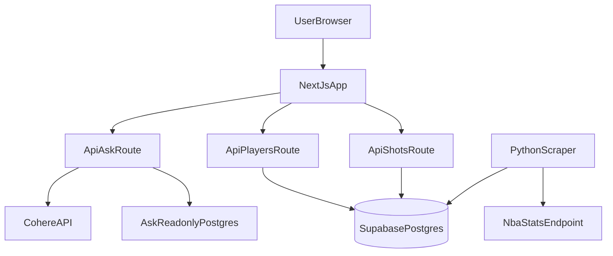

# Can He Shoot?


A full-stack student project that visualizes NBA shooting tendencies with interactive shot maps and a natural-language **Ask** interface. Ask basketball questions in plain English and get StatMuse-style answers backed by Supabase shot and season data. The frontend is built with Next.js/React, NL queries run through Cohere, and a Python ingestion script syncs data from `stats.nba.com`.

## Ask (Natural Language Queries)

The home page (`/`) is an Ask interface. Type a question like *"How many points does LeBron average this season?"* and the app:

1. Converts your question to SQL via Cohere
2. Validates and executes it read-only against Postgres (3s timeout)
3. Returns a headline answer, optional results table, and a shot-chart link when one player is resolved

**Routes:**

| Route | Purpose |
|-------|---------|
| `/` | Ask homepage |
| `/stats` | Browse all players + shot maps |
| `/stats/[personId]` | Player shot chart detail |
| `POST /api/ask` | NL query endpoint |

**Acceptance checklist** (verify after setup):

- "How many points does LeBron average this season?"
- "What's Steph Curry's 3PT% from the corner?"
- "Which player has the best free throw percentage?"
- "Compare Luka and Jokic's shot selection by zone"
- "Does [player] shoot better in the 4th quarter?"
- Out-of-scope question (e.g. "how does he shoot against the Celtics") — should fail gracefully with no hallucinated numbers

**Ask stats convention:** queries against `nba_player_stats` should filter `per_mode = 'PerGame' AND measure_type = 'Base'` (the Cohere prompt enforces this).

## Deployment Architecture

- **Frontend:** Next.js app deployed on Vercel.
- **Database:** Supabase Postgres on the free tier.
- **Connection model:** Vercel server-side routes read from Supabase using `SUPABASE_URL` + `SUPABASE_ANON_KEY` under RLS. The Ask endpoint additionally uses a scoped `ask_readonly` Postgres role via `ASK_READONLY_DATABASE_URL` and Cohere via `COHERE_API_KEY`.
- **Current data state:** 2025-26 roster + shot data has already been loaded into Supabase, so the deployed app serves data directly from the database without requiring live scraping at request time.

## Usage

### 1) Install and run locally

```bash
npm install
npm run dev
```

Then open [http://localhost:3000](http://localhost:3000).

### 2) App environment variables

Copy `.env.example` to `.env.local` and fill in:

```bash
SUPABASE_URL=...
SUPABASE_ANON_KEY=...
COHERE_API_KEY=...                  # Ask feature — server-only
ASK_READONLY_DATABASE_URL=...       # Ask feature — see setup below
```

The app performs server-side reads only, under Row Level Security.

**Ask readonly database setup** (one-time, in Supabase SQL editor):

Run [`scripts/ask_readonly_setup.sql`](scripts/ask_readonly_setup.sql), then get the **transaction-mode pooled** connection string from Supabase → Settings → Database → Connection pooling, using the `ask_readonly` credentials. Set as `ASK_READONLY_DATABASE_URL`.

For Vercel deployment, add `COHERE_API_KEY` and `ASK_READONLY_DATABASE_URL` to Project Settings → Environment Variables.

### 3) Scraper environment variables

For ingestion jobs only (do not expose to browser):

```bash
SUPABASE_URL=...
SUPABASE_SERVICE_ROLE_KEY=...
```

### 4) Run scraper

Install Python dependencies:

```bash
pip install -r scripts/requirements.txt
```

Run sync modes:

```bash
# Current dataset in Supabase is already loaded for 2025-26.
# To ingest a different year, pass --season (examples below).

# Players + shots
python scripts/nba_scraper.py --mode all
python scripts/nba_scraper.py --mode all --season 2026-27

# Players only
python scripts/nba_scraper.py --mode players
python scripts/nba_scraper.py --mode players --season 2026-27

# Shots only
python scripts/nba_scraper.py --mode shots
python scripts/nba_scraper.py --mode shots --season-type Playoffs
python scripts/nba_scraper.py --mode shots --season 2026-27 --season-type "Regular Season"

# Player stats only (Base / PerGame box scores)
python scripts/nba_scraper.py --mode stats
python scripts/nba_scraper.py --mode stats --season 2026-27
python scripts/nba_scraper.py --mode stats --season-type Playoffs
```

**Player stats setup order**

1. Sync active roster first: `python scripts/nba_scraper.py --mode players`
2. Run the `nba_player_stats` SQL below in the Supabase SQL editor (one-time)
3. Ingest regular-season stats: `python scripts/nba_scraper.py --mode stats`
4. Optionally ingest playoffs: `python scripts/nba_scraper.py --mode stats --season-type Playoffs`

**Verify player stats in Supabase**

```sql
select count(*) from nba_player_stats;

select person_id, player_name, pts, reb, ast, fg_pct
from nba_player_stats
where season = '2025-26' and season_type = 'Regular Season'
order by pts desc
limit 10;
```

### 5) Run quality checks

```bash
npm run lint
npm run typecheck
npm run test:ci
```

## Frontend Guide

### Ask workflow

1. Open `/` and type a basketball question or click an example chip.
2. Read the headline answer and optional results table.
3. If a single player was resolved, click through to their full shot chart.
4. Use **Browse Players** in the header to explore shot maps manually.

### Shot map workflow (`/stats`)

1. Open the app and start typing a player name in the search box.
2. Select a player from the active-roster results.
3. Choose `Regular Season` or `Playoffs` with the season-type toggle.
4. Pick a visualization mode:
   - **Heatmap** to compare player FG% by zone against league averages.
   - **Shot Chart** to inspect shot density over the half-court.
5. Hover zones/hexbins to view tooltips and read the shooting summary panel.

### Frontend features

- **Player search (cmdk-based):** fast lookup across active NBA players.
- **Default player on load:** the app preselects LeBron James when available to avoid an empty first screen.
- **Season-type filtering:** switches all chart and summary data between `Regular Season` and `Playoffs`.
- **Dual chart modes:**
  - **Heatmap mode:** zone-level makes, attempts, FG%, and delta vs league FG%.
  - **Shot Chart mode:** hexbin shot distribution with makes/misses filtering.
- **Makes/Misses filter (Shot Chart):** quickly isolate shot outcomes for the selected player.
- **Summary panel:** displays overall totals (FGM/FGA/FG%, 3PM/3PA/3P%) for the current view.
- **Hover tooltips:** exposes per-zone or per-hex context without leaving the chart.
- **Error state UI:** if player data fails to load, a clear fallback message is rendered with troubleshooting context.

### Tips for users

- If a player appears to have no data, switch season type first (`Regular Season` vs `Playoffs`).
- First load can feel slower while cached data warms.
- Data reflects the preloaded 2025-26 dataset currently stored in Supabase.

## System and Architecture

### Product behavior

- Search active players by name
- Toggle `Regular Season` / `Playoffs`
- Switch between:
  - **Heatmap** (zone FG% vs league average)
  - **Shot Chart** (hexbin density view)
- Inspect shooting totals and zone details in side panel + tooltips

### High-level flow



### Runtime data flow

```text
Browser -> POST /api/ask           -> Cohere (SQL + summary) + ask_readonly Postgres
Browser -> /api/players            -> Supabase nba_players (revalidate 24h)
Browser -> /api/shots/[playerId]   -> Supabase nba_shots   (revalidate 30m)
```

`/api/shots/[playerId]` paginates reads in 1000-row chunks so high-volume players return complete histories.

### Ingestion design

- `scripts/nba_scraper.py` uses bounded retries and jittered delays between NBA requests.
- `--mode all` uses one players request and four league-wide shot windows (three regular-season windows + playoffs), not per-player shot loops.
- Upserts are idempotent:
  - `nba_players` keyed by `person_id`
  - `nba_shots` keyed by `shot_id`
  - `nba_player_stats` keyed by `(person_id, season, season_type, per_mode, measure_type)`
- Playoff rows use `po_` prefixed `shot_id` values to avoid collisions with regular-season rows.
- `--mode stats` pulls one `leaguedashplayerstats` request per run (Base / PerGame).

### Supabase security setup (RLS)

Run once in Supabase SQL editor:

```sql
alter table public.nba_players enable row level security;
alter table public.nba_shots enable row level security;

drop policy if exists "Public read nba_players" on public.nba_players;
drop policy if exists "Public read nba_shots" on public.nba_shots;

create policy "Public read nba_players"
  on public.nba_players for select
  to anon, authenticated
  using (true);

create policy "Public read nba_shots"
  on public.nba_shots for select
  to anon, authenticated
  using (true);
```

Also ensure `season_type` exists on `nba_shots`:

```sql
alter table nba_shots
  add column if not exists season_type text not null default 'Regular Season';

create index if not exists idx_nba_shots_person_id_season_type
  on nba_shots (person_id, season_type);
```

Create `nba_player_stats` (run once before `--mode stats`):

```sql
create table if not exists public.nba_player_stats (
  person_id bigint not null references public.nba_players (person_id),
  season text not null,
  season_type text not null,
  per_mode text not null,
  measure_type text not null,
  player_name text,
  team_id integer,
  team_abbreviation text,
  age numeric,
  gp integer,
  w integer,
  l integer,
  w_pct numeric,
  min numeric,
  fgm integer,
  fga integer,
  fg_pct numeric,
  fg3m integer,
  fg3a integer,
  fg3_pct numeric,
  ftm integer,
  fta integer,
  ft_pct numeric,
  oreb integer,
  dreb integer,
  reb integer,
  ast integer,
  tov integer,
  stl integer,
  blk integer,
  blka integer,
  pf integer,
  pfd integer,
  pts numeric,
  plus_minus numeric,
  nba_fantasy_pts numeric,
  dd2 integer,
  td3 integer,
  updated_at timestamptz not null default now(),
  primary key (person_id, season, season_type, per_mode, measure_type)
);

create index if not exists idx_nba_player_stats_season_season_type
  on public.nba_player_stats (season, season_type);

alter table public.nba_player_stats enable row level security;

drop policy if exists "Public read nba_player_stats" on public.nba_player_stats;

create policy "Public read nba_player_stats"
  on public.nba_player_stats for select
  to anon, authenticated
  using (true);
```

## CI workflow note

This repo stores the workflow definition at `scripts/ci.yml` per project preference. GitHub auto-discovers workflow files only under `.github/workflows/`, so copy or symlink this file there if you want Actions to run automatically on GitHub.

## Limitations and Tradeoffs

- `stats.nba.com` is Akamai-protected, so fully automated cloud scraping can be unstable.
- The project prioritizes stable frontend UX and deterministic testability over always-on live scraping.
- Recommended operation is periodic/manual ingestion into Supabase, then serving from the database.
- **Ask SQL validation** uses a regex/keyword guard, not a full SQL parser — sufficient for v1 given prompt constraints, but `node-sql-parser` is the honest fast-follow before wider sharing.
- **Ask rate limiting** is an in-memory per-IP counter (20 req/hour). Best-effort on serverless (resets per instance). Upstash Redis is the correct fast-follow before wider sharing.

## Fast-follows (out of scope for v1)

- Multi-turn conversation / follow-up questions with memory
- Upstash Redis distributed rate limiting
- Proper SQL parser (`node-sql-parser`) for validation
- Opponent-specific queries (no opponent field in schema yet)
- Local fine-tuned model (documented v2 story — v1 runs on Cohere)
